Руководство Администратора
==========================

.. contents::

Начало работы
-------------

Для того, чтобы начать работу с ботом, нужно отправить `ему <https://vk.me/ralphb>`_ сообщение с текстом "Начать" (то же действие выполняет "Старт").
В ответ появляется клавиатура с главным меню. Она выглядит так:

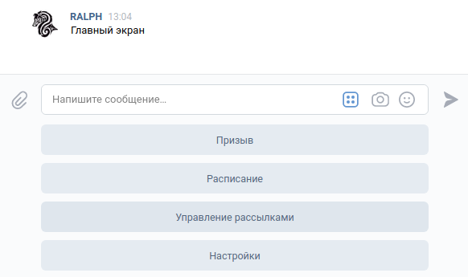

Описание функционала
--------------------

Призыв
~~~~~~

*Позволяет отправить в беседу студентов упоминание (@id...) выбранных обучающихся или всех разом.*

Чтобы отправить призыв, нужно выбрать в главном меню одноимённую кнопку и следовать дальнейшим указаниям:

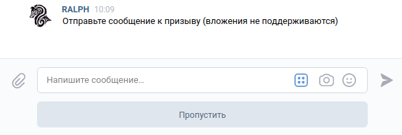

Сообщение к призыву можно не указывать.

Далее нужно выбрать получателей призыва (получат все участники беседы, но уведомление придёт только выбранным)

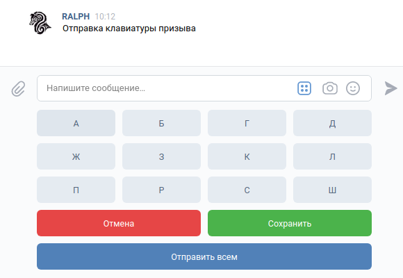

Каждая кнопка с буквой - это подменю, в котором собраны все фамилии, начинающиеся на эту букву. С помощью этих кнопок можно собрать список людей, которых нужно призвать.

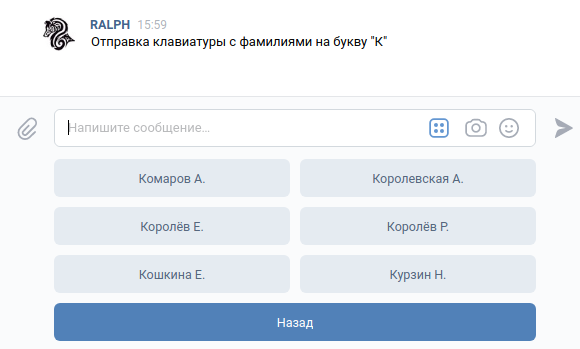

Когда список будет собран, нажмите на кнопку "Сохранить"

Вам будет показано сформированное сообщение с подтверждением отправки:

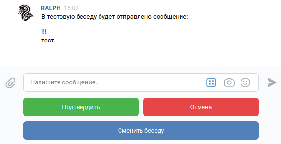

Нажатие "Подтвердить" отправляет сообщение в беседу;  
Нажатие "Отмена" возвращает в главное меню и очищает сохранённые данные;  
Нажатие "Сменить беседу" переключает активную беседу (тестовая/основная) и повторно спрашивает разрешения на отправку.

Управление рассылками
~~~~~~~~~~~~~~~~~~~~~

В отличие от простых пользователей Администраторы способны также вручную отправлять рассылки любого типа.

При нажатии на кнопку "Управление рассылками" открывается подменю со списком доступных рассылок.

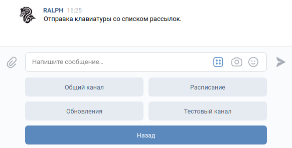

Каждая из этих рассылок это подменю, из которого доступно отправка рассылки или управление подписками:

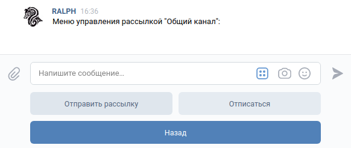

Отправка рассылок
"""""""""""""""""

При нажатии этой кнопки вам будет предложено ввести текст рассылки:

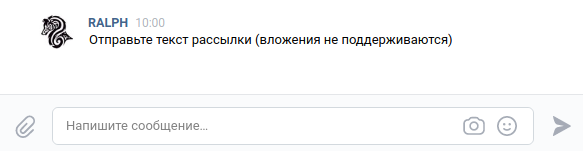

После сохранения текста вы сможете подтвердить отправку и сообщение автоматически улетит подписчикам выбранной вами рассылки:

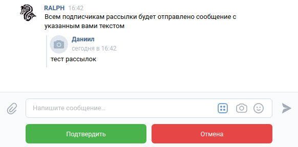

Нажатие кнопки "Подтвердить" отправляет рассылку,  
кнопки "Отмена" удаляет сохраненные данные и возвращается на экран со списком клавиатур.

Подписки
""""""""

У каждого пользователя есть статус подписки на любую рассылку. По умолчанию подписки выглядят так:

- Общий канал: активно
- Расписание: активно
- Обновления: неактивно
- Тестовый канал: неактивно

Любой пользователь всегда может самостоятельно изменить свой список подписок.

Расписание
~~~~~~~~~~

Нажатие кнопки "Расписание" открывает подменю с выбором даты для получения расписания.

Доступные варианты:

- на сегодня
- на завтра
- на послезавтра
- на любую дату (в формате ДД-ММ-ГГГГ)

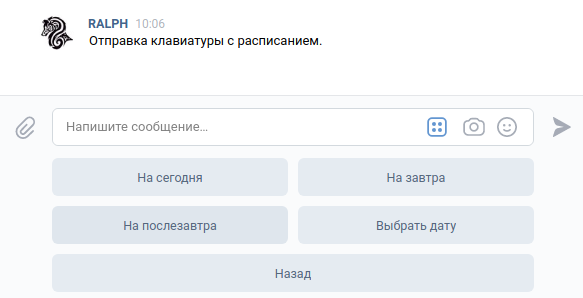

При запросе расписания на любую дату бот спросит на какую дату нужно получить расписание.
При этом встроена проверка на валидность

Пример **валидной даты**: 13-02-2020

Примеры **невалидной даты**:

- 13.12.2020 (использованы точки вместо дефисов)
- 13/12/2020 (использованы слеши вместо дефисов)
- и т.д.

Настройки
~~~~~~~~~

Это подменю с двумя опциями, которые можно изменить для себя (то есть глобальные параметры они не затрагивают)

Смена беседы
""""""""""""

При нажатии на кнопку "Сменить беседу" бот сообщит о текущей выбранной беседе и предложит переключиться на другую.

Всего доступно две беседы:

- Основная
- Тестовая

Использование имён в призыве
""""""""""""""""""""""""""""

При нажатии на кнопку "Использование имён в призыве" бот сообщит о текущем состоянии опции и предложит переключиться.

**На что это влияет**

На формат сообщения призыва. Если опция выключена, призыв выглядит так:

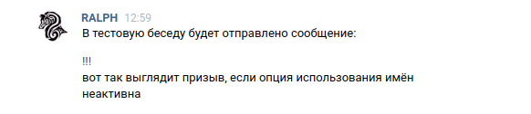

Если включена, тогда так:

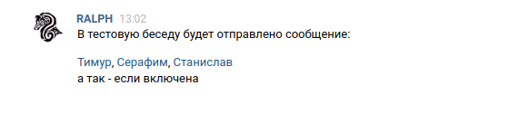

