##########################
Руководство Администратора
##########################

.. contents::

*************
Начало работы
*************

Для того, чтобы начать работу с ботом, нужно отправить боту, связанным с вашим учебным заведением (см. :ref:`list-of-connected-places`) сообщение с текстом "Начать" (то же действие выполняет "Старт").

В ответ появляется клавиатура с главным меню. Она выглядит так:

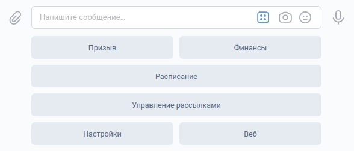

********************
Описание функционала
********************

Призыв
======

*Позволяет отправить в беседу студентов упоминание (@id...) выбранных обучающихся или всех разом.*

Чтобы отправить призыв, нужно выбрать в главном меню одноимённую кнопку и следовать дальнейшим указаниям:

.. figure:: ../_static/images/ralph/call/6.4.0/ask_for_message.png
       :align: center
       :alt: Запрос текста призыва

Сообщение к призыву можно не указывать.

Далее нужно выбрать получателей призыва (получат все участники беседы, но уведомление придёт только выбранным)

.. figure:: ../_static/images/ralph/call/6.1.5/call_keyboard.png
       :align: center
       :alt: Клавиатура призыва

Каждая кнопка с буквой - это подменю, в котором собраны все фамилии, начинающиеся на эту букву. С помощью этих кнопок можно собрать список людей, которых нужно призвать.

.. figure:: ../_static/images/ralph/call/6.1.5/submenu.png
       :align: center
       :alt: Подменю призыва

Когда список будет собран, нажмите на кнопку "Сохранить"

Вам будет показано сформированное сообщение с подтверждением отправки:

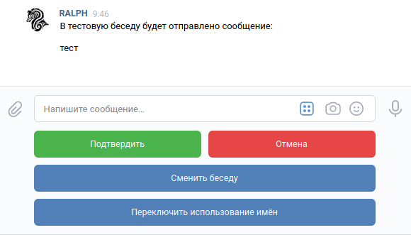

Нажатие "Подтвердить" отправляет сообщение в беседу;  
Нажатие "Отмена" возвращает в главное меню и очищает сохранённые данные;  
Нажатие "Сменить беседу" переключает активную беседу (тестовая/основная) и повторно спрашивает разрешения на отправку.
Нажатие "Переключить использование имён" перегенерирует сообщение с изменёнными настройками использования имён

Управление рассылками
=====================

В отличие от простых пользователей Администраторы способны также вручную отправлять рассылки любого типа.

При нажатии на кнопку "Управление рассылками" открывается подменю со списком доступных рассылок.

.. figure:: ../_static/images/ralph/mailings/6.1.5/available.png
       :align: center
       :alt: Доступные подписки

Каждая из этих рассылок это подменю, из которого доступно отправка рассылки или управление подписками:

.. figure:: ../_static/images/ralph/mailings/6.1.5/mailing_menu.png
       :align: center
       :alt: Меню подписки

Отправка рассылок
-----------------

При нажатии этой кнопки вам будет предложено ввести текст рассылки:

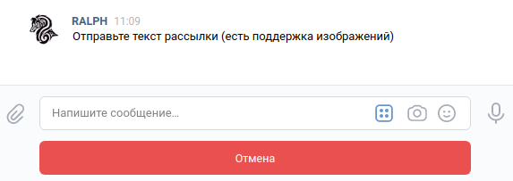

После сохранения текста вы сможете подтвердить отправку и сообщение автоматически улетит подписчикам выбранной вами рассылки:

.. figure:: ../_static/images/ralph/mailings/6.1.5/confirm.png
       :align: center
       :alt: Клавиатура призыва

Нажатие кнопки "Подтвердить" отправляет рассылку,  
кнопки "Отмена" удаляет сохраненные данные и возвращается на экран со списком клавиатур.

Подписки
--------

У каждого пользователя есть статус подписки на любую рассылку. По умолчанию подписки выглядят так:

- Общий канал: активно
- Расписание: активно
- Обновления: неактивно
- Тестовый канал: неактивно

Любой пользователь всегда может самостоятельно изменить свой список подписок.

Расписание
==========

Нажатие кнопки "Расписание" открывает подменю с выбором даты для получения расписания.

Доступные варианты:

- на сегодня
- на завтра
- на послезавтра
- на любую дату (в формате ДД-ММ-ГГГГ)

.. figure:: ../_static/images/ralph/schedule/6.1.5/menu.png
       :align: center
       :alt: Меню расписания

При запросе расписания на любую дату бот спросит на какую дату нужно получить расписание.
При этом встроена проверка на валидность

Пример **валидной даты**: 13-02-2020

Примеры **невалидной даты**:

- 13.12.2020 (использованы точки вместо дефисов)
- 13/12/2020 (использованы слеши вместо дефисов)
- и т.д.

Настройки
=========

Это подменю с двумя опциями, которые можно изменить для себя (то есть глобальные параметры они не затрагивают)

.. figure:: ../_static/images/ralph/settings/7.0.0/settings.png
       :align: center
       :alt: Настройки

Чаты
----

Это подменю в котором можно выбрать уровень настроек (глобальный - влияет на группу, локальный - на текущего администратора)

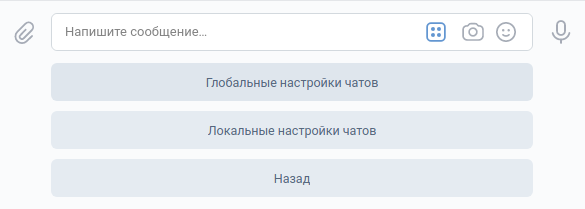

Глобальные настройки
^^^^^^^^^^^^^^^^^^^^

Перечисляет ассоциированные с группой пользователя чаты и позволяет их настроить

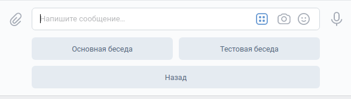

Когда в группе пользователя не настроены все чаты (тестовый/основной) и в кэше есть неразмеченные чаты, появляется кнопка "Зарегистрировать чат", которая позволяет присвоить чату тип (тестовый/основной)

Настройка чата
""""""""""""""

Каждый чат, прикрепленный к группе может быть выбран как активный (но только один одновременно)

В активный чат будет приходить автоматическая рассылка (с расписанием, например)

Когда вы активируете чат, другой автоматически становится неактивным

Открепить чат значит сообщить боту, что чат больше не будет использоваться по своему назначению. По факту это удаление. Разница лишь в том, что бот поместит этот чат в специальный кэш, куда попадают все неразмеченные чаты, в том числе, чаты, в которые бота только что пригласили и его можно будет назначить обратно.

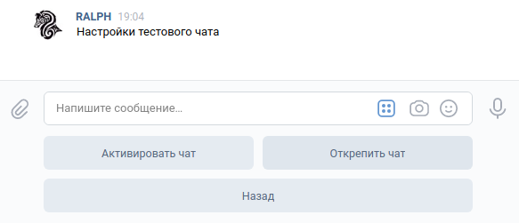

Локальные настройки
^^^^^^^^^^^^^^^^^^^^

Позволяет выбрать в какой чат будут приходить Призывы от этого администратора. Не влияет на активность чата на уровне группы

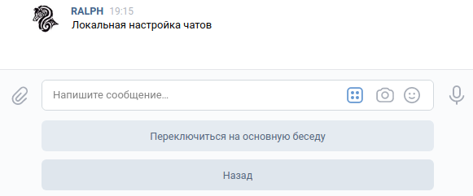

Использование имён в призыве
----------------------------

При нажатии на кнопку "Использование имён в призыве" бот сообщит о текущем состоянии опции и предложит переключиться.

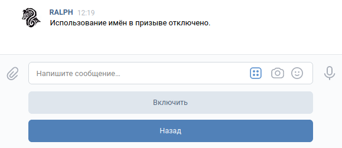

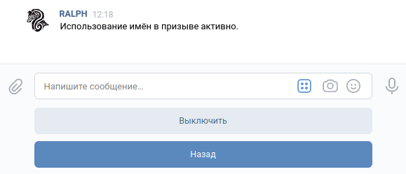

**На что это влияет**

На формат сообщения призыва. Если опция выключена, призыв выглядит так:

.. figure:: ../_static/images/ralph/call/6.2.0/examples/names_off.png
       :align: center
       :alt: Пример готового призыва с выключенными именами

Если включена, тогда так:

.. figure:: ../_static/images/ralph/call/6.2.0/examples/names_on.png
       :align: center
       :alt: Пример готового призыва со включенными именами

.. toctree::
       :includehidden:

Финансы
=======

Блок Финансов содержит набор функций, используемых для управления бюджетом группы.
Её меню выглядит так:

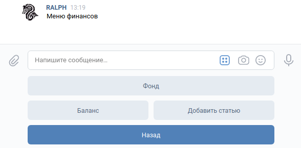

.. important::
       Бот фактически не управляет бюджетом, а лишь вносит записи в базу данных. То есть положив деньги на карту, не стоит ожидать, что бот об этом узнает и внесет соответствующую запись, это нужно делать вручную через интерфейсы бота, о которых ниже.

Главное меню
------------

Категории
^^^^^^^^^

Они появляются по мере создания новых категорий расходов. По нажатию на них открывается меню категории

Баланс
^^^^^^

С помощью этой кнопки можно получить состояние бюджета группы с учетом всех операций во всех категориях

Добавить статью
^^^^^^^^^^^^^^^

Здесь можно создать новую категорию расходов. Формат сообщения:
**<имя>,<сумма сбора>**

Пробелы не важны. Главное - отделить сумму сбора от названия запятой. Иначе бот будет ругаться на неверный формат сообщения.

Меню категории
--------------

Через меню категории расхода ведется все основное управление бюджетом.

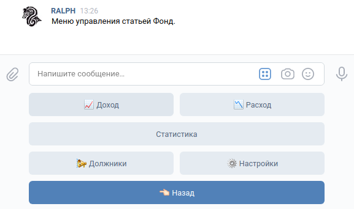

Доход
^^^^^

Меню "Доход" создает запись о внесении средств на счет группы. Для этого нужно будет выбрать человека, внесшего деньги и сумму взноса.
Для выбора человека предоставляется похожая менюшка, как и в меню "Призыв". Разница лишь в том, что после выбора человека подтверждать ничего не нужно, автоматически производится переход на следующий этап.

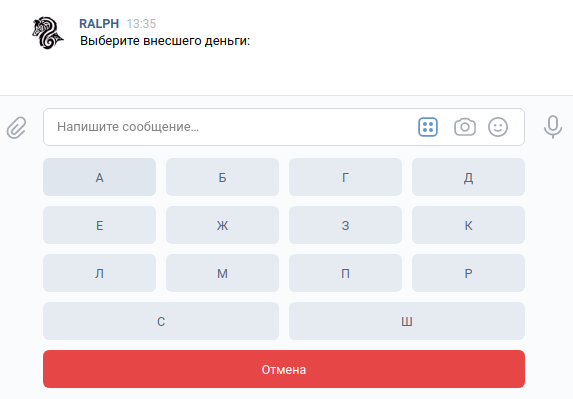

Далее нужно будет отправить сообщение с суммой взноса, которое должно содержать только число. В противном случае, бот откажется принимать значение и будет ожидать сообщения в нормальной форме.

После этого запись о взносе будет создана и пользователя перенесет в меню категории расхода

Расход
^^^^^^

Меню "Расход" создает запись о тратах в рамках категории. Нужно просто указать сумму расходов.

Статистика
^^^^^^^^^^

Меню "Статистика" вычисляет некоторые данные о сборе в рамках категории.

Эта информация выводится в диалог:

- Всего сдали (количество человек)
- Всего не сдали (количество человек)
- Всего собрано (сумма)

Должники
^^^^^^^^

Меню "Должники" формирует в беседу призыв людей, не сдавших деньги на определенную статью. Процесс полностью автоматизирован, от пользователя требуется только подтвердить отправку и изменить параметры, если это необходимо. Параметры те же, что и у Призыва:

.. seealso::
       `Настройки`_

Настройки категории
^^^^^^^^^^^^^^^^^^^

Меню "Настройки" позволяет сконфигурировать уже существующую категорию расходов

Доступны следующие параметры:

- Переименование
- Изменение суммы сбора
- Удаление

.. figure:: ../_static/images/ralph/finances/6.5.0/cat_settings.png
       :align: center
       :alt: Настройки категории

.. warning::
       Удаление категории ведет к удалению всех связанных записей (как расходов, так и доходов)

Веб
===

Меню Веб показывает список групп, доступных пользователю для администрирования.

При переходе на одну из таких кнопок генерируется ссылка авторизации для входа под аккаунтом выбранной группы в веб-интерфейс.

Ссылка одноразовая и работает в течение 5 минут.

.. important::

       Поскольку ВК не дает пользователям выбора, на какие сайты переходить можно, а на какие нет, то без средств обхода vk.com/away.php попасть в веб-интерфейсы невозможно