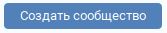
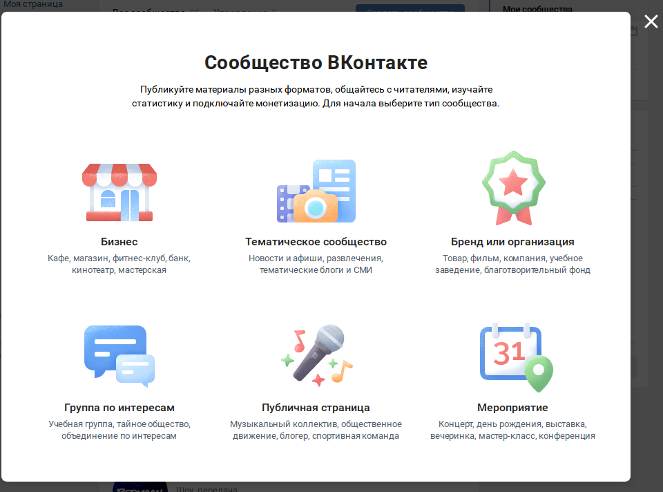
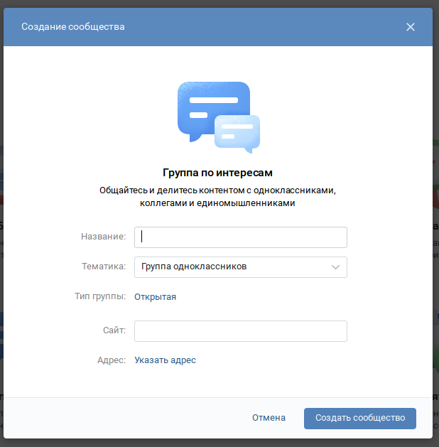
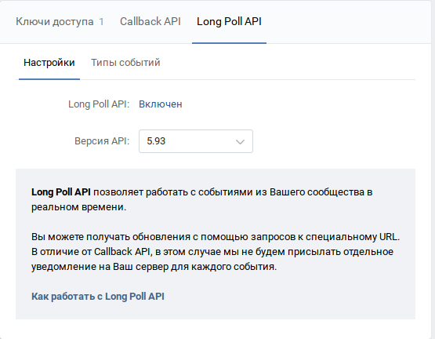
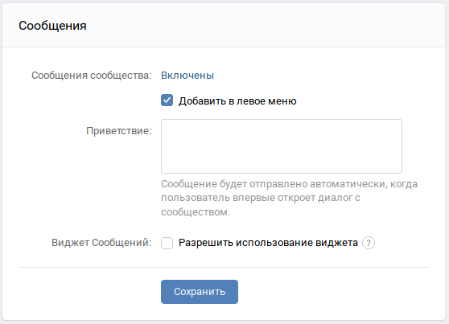
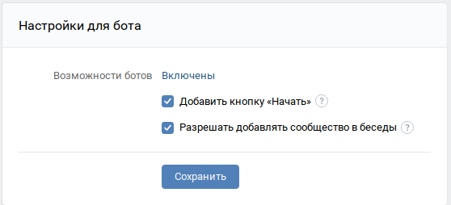
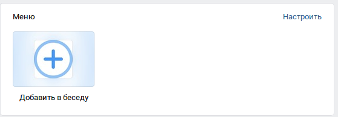

Руководство по внедрению системы
================================

.. contents::

Создание и настройка группы ВКонтакте
-------------------------------------

.. figure:: https://raster.shields.io/badge/сложность-просто-brightgreen.png
       :alt: Сложность

Ботов ВКонтакте можно привязывать только к группам. Для её создания перейдите в раздел сообществ из бокового меню:

Там нажмите на кнопку "Создать сообщество"

В открывшемся меню выберите "Группа по интересам"

На ваше усмотрение заполните данные группы

.. note::
	*Я не стал создавать новое сообщество, остальные шаги заполните сами*

Перейдите в раздел "Управление" нового сообщества

.. figure:: ../_static/images/adopt/vk/managing_button.png
       :align: center
       :alt: Кнопка Управление

Затем в подраздел "Работа с API":

Здесь нужно создать токен сообщества со следующими правами:

*управление сообществом, сообщения сообщества, фотографии, документы, стена*

.. figure:: ../_static/images/adopt/vk/create_token.png
       :align: center
       :alt: Создание токена

Скопируйте себе этот токен, в дальнейшем он нам понадобится.

.. warning::
	Никому не передавайте этот токен! Он позволяет управлять вашим сообществом

Перейдите во вкладку Long Poll API и включите его. Выберите версию API 5.103

Затем во вкладке типы событий установите все галочки (если выбрать только нужные, ни черта не работает, очередные ограничения платформы)

Далее, в разделе "Сообщения" нужно включить сообщения сообщества.

По желанию можно настроить приветствие. Это сообщение, которое получит пользователь, впервые открывший диалог с ботом.

Нажмите "Сохранить".

Затем, в подразделе "Настройки для бота" включите "Возможности ботов" и выберите обе галочки. После завершения настройки, можно убрать разрешение на приглашение в беседы.

Снова нажмите "Сохранить"

Создайте отдельную беседу для тестирования и обучения администраторов.

Вернитесь к сообществу. У вас появится меню с одной кнопкой - "Добавить в беседу".

Нажмите на неё и выберите тестовую беседу, сохраните. (На всякий случай сделаем добавим беседы по отдельности, чтобы точно быть уверенными в правильном присвоении идентификаторов)

Снова откройте это меню, и добавьте бота в основную беседу, где собраны студенты.

Вернитесь к беседам. Откройте список участников и найдите среди них своего бота. Сделайте его администратором беседы, чтобы дать ему доступ на написание сообщений в этой беседе. (это может сделать только действующий администратор или создатель)

Это действие нужно повторить с обоими беседами.

Теперь можно вернуться в настройки сообщений сообщества и отключить возможность добавления сообщества в беседы.

Получение свежей версии кода
----------------------------

.. figure:: https://raster.shields.io/badge/сложность-средне-yellow.png
       :align: center
       :alt: Сложность

В Ральфе применяется система контроля версий Git. Это позволяет легко:

- распространять новые версии кода всем участникам разработки
- откатываться на любую из уже сохранённых версий

Для того чтобы всегда иметь доступ к свежей версии кода, нужно

1. Авторизоваться на Github (Если аккаунта еще нет, можно завести его `здесь <https://github.com/join>`_)

2. Скачать и установить Git CLI (инструмент командной строки для работы с Git - репозиторием)

3. Подписаться на уведомления об обновлениях репозитория

4. Обновлять свою копию репозитория, когда выходят новые версии

Регистрацию я пояснять не буду, там нет ничего сложного. А вот остальные пункты стоит разъяснить.

2. Большую часть работы придётся выполнять с помощью командной строки / терминала.

        Во-первых нужно скачать сам инструмент. Для Windows стоит использовать проект от сообщества Git for Windows. `Скачать <https://github.com/git-for-windows/git/releases/latest>`_. От официального продукта он отличается только тем, что имеет свою linux-подобную командную оболочку и какой-никакой, но графический интерфейс.

        С linux-системами всё намного проще. Git есть в стандартном репозитории многих дистрибутивов. Например, для debian-подобных систем можно установить git такой командой:

        .. code-block:: shell

        	sudo apt install git

        После установки git нужно настроить. Поскольку коммиты (проще говоря, точки сохранения кода) принадлежат конкретным людям (то есть в каждый коммит записывается информация о его создателе - имя и email), нужно это настроить:

        .. code-block:: shell

        	git config --global user.name="<ваше имя без угловых скобок>"

        .. code-block:: shell

			git config --global user.email="<ваш email без угловых скобок>"

        Теперь, чтобы загрузить себе последнюю доступную версию репозитория нужно форкнуть себе репозиторий, нажав кнопку на кнопку Fork на странице репозитория:

		.. figure:: ../_static/images/adopt/github/fork_button.png
			:align: center
			:alt: Fork

        Скачайте последнюю версию кода, склонировав себе репозиторий: 

        .. code-block:: shell

        	git clone --branch=master https://github.com/<ваш ник>/ralph.git

        Вы получите новую папку со всем кодом бота.

3. Уведомления об обновлениях репозитория приходит по электронной почте. Чтобы их включить, нужно нажать на кнопку Watch вверху основного репозитория:

		.. figure:: ../_static/images/adopt/github/watch_button.png
			:align: center
			:alt: Watch button

        и в появившемся меню выбрать Releases only.

        Теперь, когда Ральф получит новое обновление вы получите уведомление на почту.

4. Чтобы обновить свою версию нужно выполнить:

        .. code-block:: shell

        	git pull origin master

Модификация кода
----------------

.. figure:: https://raster.shields.io/badge/сложность-средне-yellow.png
       :align: center
       :alt: Сложность

Код написан без жёсткой привязки к конкретному учереждению. Его можно легко адаптировать под любые нужды.

Модуль получения расписания хранится в файле `scheduler.py <https://github.com/dadyarri/ralph/blob/master/scheduler.py>`_.

Документация по этому модулю находится в отдельном `файле <../code/scheduler>`_.

Так же, для локального тестирования нужно создать файл **.env**, где будут записаны переменные окружения.

Чтобы сохранить в репозитории сделанные изменения, нужно сделать коммит:

Сохраним изменения:

.. code-block:: shell

	git add .

И создадим коммит:

.. code-block:: shell

	git commit -m "<краткое описание сделанных вами изменений>"

Отправим изменения на сервер

.. code-block:: shell

	git push origin master

Настройка переменных окружения
------------------------------

.. figure:: https://raster.shields.io/badge/сложность-просто-brightgreen.png
       :align: center
       :alt: Сложность

Переменные окружения - это особый файл с секретными данными, которые нельзя нигде публиковать.

В случае с Ральфом там хранится токен сообщества, токен администратора, URL доступа к базе данных, и для удобства - список идентификаторов администраторов, настройки модуля логгирования, идентификатор беседы и сообщества с ботом.

Вот готовый шаблон файла с переменными окружения:

.. code-block:: shell

	ADMINS_IDS="<цифровые идентификаторы пользователей ВК, которые должны иметь доступ к функциями администратора, разделённые запятой>"
	CID_ID="<идентификатор беседы, в которую будет срабатывать автоматическая рассылка расписания. 2000000001 - тестовая, 2000000002 - основная>"
	DATABASE_URL="<ссылка доступа к базе данных. Ниже будет сказано, как её получить>"
	GID_ID="<идентификатор группы с ботом>"
	LOG_FMT="%(levelname)s: %(message)s" # Формат логов
	LOG_LEVEL="20" # Уровень логгирования. Указывает на то, логи какого уровня печатать. Подробнее здесь: `<https://docs.python.org/3/library/logging.html#levels>`_
	VK_TOKEN="<токен сообщества>"
	VK_USER_TOKEN="<токен администратора. Нужен для автоматического изменения номера версии в статусе группы>"

Выгрузка на хостинг
-------------------

.. figure:: https://raster.shields.io/badge/сложность-средне-yellow.png
       :align: center
       :alt: Сложность

Я предлагаю использовать в качестве хостинга `Heroku <https://heroku.com>`_. У них есть бесплатный тариф, но с ограничением по трафику в 550 часов / месяц. По моему опыту этого достаточно. Для работы с Heroku нужно:

- `зарегистрировать <https://signup.heroku.com/>`_ аккаунт
- установить `CLI <https://devcenter.heroku.com/articles/heroku-cli>`_

Все действия из списка ниже нужно выполнять в папке Ralph со всеми исходниками бота

1. Авторизуемся в CLI:

.. code-block:: shell

	heroku auth

2. Создаём приложение:

.. code-block:: shell

	heroku create

Имя приложения будет сгенерировано автоматически.

3. Подключаем к приложению базу данных PostgreSQL:

.. code-block:: shell

	heroku addons:create heroku-postgresql:hobby-dev

4. Теперь код можно выгрузить на сервер и запустить:

.. code-block:: shell

	git push heroku master

5. И запустить:

.. code-block:: shell

	heroku ps:scale bot=1 sch=1

Бот уже работает!

Осталось только заполнить базу данных сведениями о студентах.