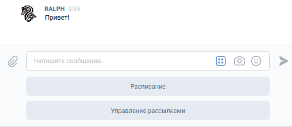

Руководство пользователя
========================

.. contents::

Начало работы
-------------

Для того, чтобы начать работу с ботом, нужно отправить `ему <https://vk.me/ralphb>`_ сообщение с текстом "Начать" (то же действие выполняет "Старт").
В ответ появляется клавиатура с главным меню. Она выглядит так:

Описание функционала
--------------------

Расписание
~~~~~~~~~~

Нажатие кнопки "Расписание" открывает подменю с выбором даты для получения расписания.

Доступные варианты:

- на сегодня
- на завтра
- на послезавтра
- на любую дату (в формате ДД-ММ-ГГГГ)

.. figure:: ../_static/images/ralph/schedule/6.1.5/menu.png
       :align: center
       :alt: Меню расписания

При запросе расписания на любую дату бот спросит на какую дату нужно получить расписание.
При этом встроена проверка на валидность

Пример **валидной даты**: 13-02-2020

Примеры **невалидной даты**:

- 13.12.2020 (использованы точки вместо дефисов)
- 13/12/2020 (использованы слеши вместо дефисов)
- и т.д.

Управление рассылками
~~~~~~~~~~~~~~~~~~~~~

В отличие от простых пользователей Администраторы способны также вручную отправлять рассылки любого типа.

При нажатии на кнопку "Управление рассылками" открывается подменю со списком доступных рассылок.

.. figure:: ../_static/images/ralph/mailings/6.1.5/available.png
       :align: center
       :alt: Доступные подписки

Каждая из этих рассылок это подменю, из которого доступно отправка рассылки или управление подписками:

.. figure:: ../_static/images/ralph/mailings/6.1.5/mailing_menu.png
       :align: center
       :alt: Меню подписки

Подписки
""""""""

У каждого пользователя есть статус подписки на любую рассылку. По умолчанию подписки выглядят так:

- Общий канал: активно
- Расписание: активно
- Обновления: неактивно
- Тестовый канал: неактивно

Любой пользователь всегда может самостоятельно изменить свой список подписок.

